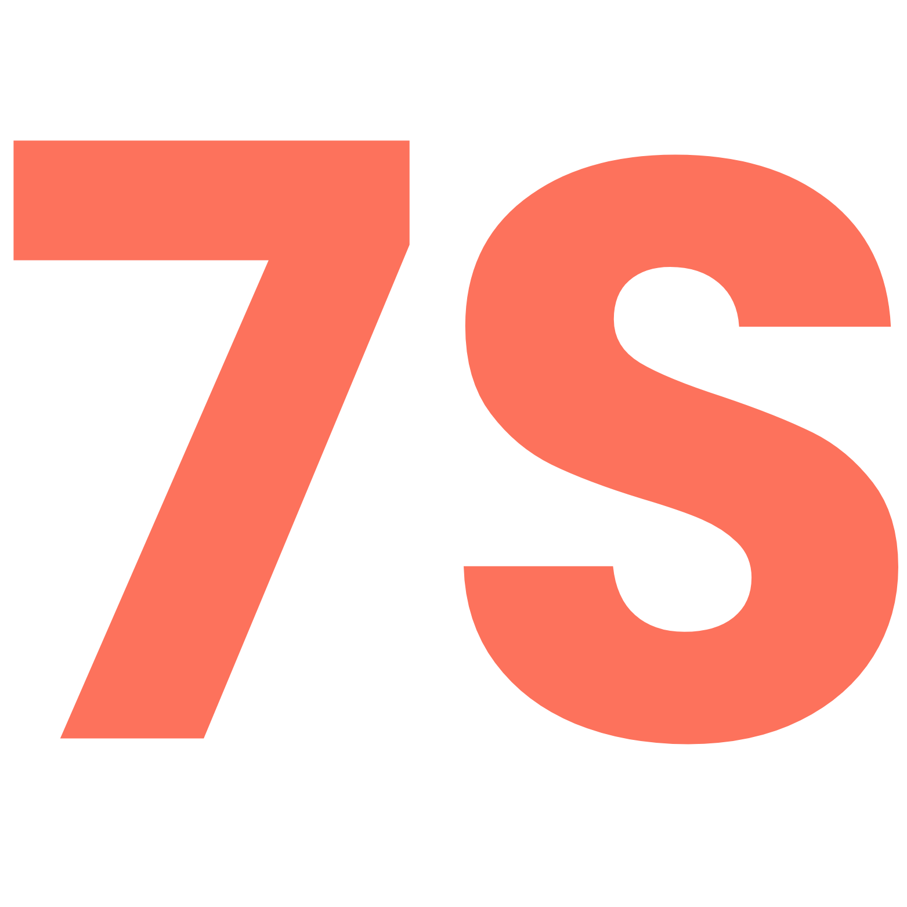

# Sept Sec (7S)



## Overview

Sept Sec (7S) is a professional dry cleaning service website catering to both businesses and individuals. The site showcases eco-friendly cleaning services provided by expert cleaners who are trusted by over 50 businesses.

## Features

- **Responsive Design**: Fully responsive website that works across desktop, tablet, and mobile devices
- **Modern UI**: Clean, professional interface with intuitive navigation
- **Bootstrap Framework**: Built with Bootstrap for consistent styling and components

## Pages

1. **Home** - Main landing page featuring service highlights and hero section
2. **About** - Information about the company and services
3. **Pricing** - Service pricing details
4. **Contact** - Contact information and inquiry form
5. **Login&Signup** - Customer portal access

## Technology Stack


## Setup and Installation

1. Clone the repository:
```sh
git clone https://github.com/med6ba/sept-sec.git
```

2. Navigate to the project directory:
```sh
cd sept-sec
```

3. Open the `index.html` file in your browser to view the website locally.

## Deployment

The website is currently deployed on Vercel at [View DEMO](https://sept-sec.vercel.app)

## Key Features Highlighted

- **100% Eco-Friendly** cleaning processes
- **Expert Cleaners** with professional experience
- **Trusted by 50+ businesses** in the industry

## Contributing

1. Fork the repository
2. Create your feature branch (`git checkout -b feature/amazing-feature`)
3. Commit your changes (`git commit -m 'Add some amazing feature'`)
4. Push to the branch (`git push origin feature/amazing-feature`)
5. Open a Pull Request

## License

This project is licensed under the MIT License - see the <a href="https://github.com/med6ba/sept-sec/blob/main/LICENSE">LICENSE</a> file for details.
